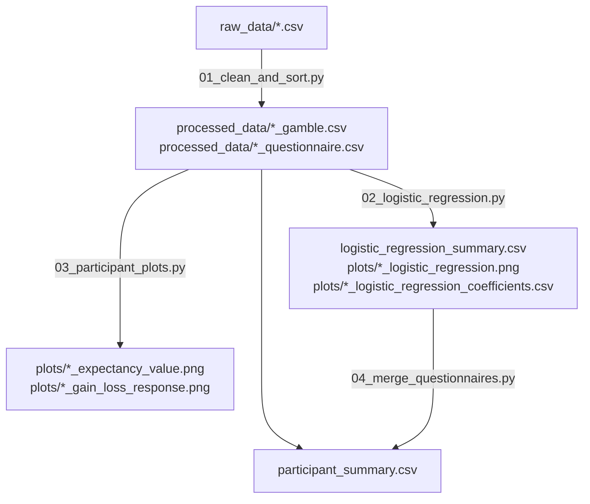

# Pipeline

Dieses Dokument beschreibt die vollständige Datenpipeline der Mixed-Gamble-
Loss-Aversion-Studie: von den rohen PsychoPy/PsychoJS-Exporten in `raw_data/`
bis zur finalen Teilnehmer-Zusammenfassung mit Regressionskoeffizienten,
Plots und Fragebogendaten.

Das Projekt ist bewusst einfach gehalten: Es ist **kein** Python-Paket.
Es besteht aus vier eigenständigen, nummerierten Skripten in
[scripts/](scripts/). Jedes Skript liest CSV-Dateien von der Festplatte und
schreibt CSV-/PNG-Dateien zurück. Führe sie der Reihe nach aus (01 bis 04);
die Ausgabe jedes Schritts ist die Eingabe des nächsten.



Eine hochauflösende Darstellung dieses Diagramms findet sich unter
[docs/pipeline_diagram.png](docs/pipeline_diagram.png).

## Warum die Pipeline so aufgebaut ist

- **Ein Skript pro Transformationsschritt.** Jedes Skript hat genau eine klar
  benannte Aufgabe (bereinigen, Modell anpassen, plotten, zusammenführen).
  Das macht es einfach, einen einzelnen Schritt erneut auszuführen, sein
  Zwischenergebnis als einfache CSV-Datei zu prüfen oder einen Schritt
  auszutauschen, ohne den Rest der Pipeline anzufassen.
- **Reine CSV-/PNG-Dateien als Schnittstelle zwischen den Schritten**, nicht
  In-Memory-Objekte oder eine Datenbank. Jedes Zwischenergebnis ist eine
  Datei, die man in Excel öffnen, mit `pandas` untersuchen oder an
  Mitarbeitende weitergeben kann. Das macht die gesamte Pipeline
  nachvollziehbar und leicht zu debuggen.
- **Kein gemeinsames Python-Paket.** Da jedes Skript nur `pandas`, `numpy`,
  `matplotlib` oder `scikit-learn` benötigt und Dateien über
  Kommandozeilenargumente liest/schreibt, braucht es kein installierbares
  Paket, keine Entry-Points und keine `PYTHONPATH`-Tricks. Man ruft einfach
  `python scripts/0N_name.py [Optionen]` auf.
- **Teilnehmer-IDs als Verknüpfungsschlüssel.** Jede Gamble-, Fragebogen- und
  Koeffizienten-Datei heißt `<participant-id>_<suffix>.csv`. Nachgelagerte
  Skripte führen die Daten über die Spalte `participant` zusammen (oder über
  die aus dem Dateinamen abgeleitete ID, falls `participant` fehlt). So
  können Teilnehmende beliebig hinzugefügt, entfernt oder neu verarbeitet
  werden, ohne die Dateien anderer Teilnehmender anzufassen.
- **Modellfreie Plots neben dem Modell.** Die Plots aus Schritt 3
  (Expectancy Value und Gain-vs-Loss) visualisieren dasselbe rohe
  Antwortmuster, das die logistische Regression in Schritt 2 numerisch
  zusammenfasst, ganz ohne Modellannahmen. Das macht es einfach, die
  Regressionsergebnisse auf Plausibilität zu prüfen.

## Verwendete Bibliotheken

| Bibliothek | Verwendung |
|---|---|
| `pandas` | Lesen/Schreiben von CSV-Dateien, tabellarische Datenverarbeitung in jedem Skript |
| `numpy` | Numerische Arrays, vektorisierte Berechnungen |
| `matplotlib` | Alle Plots (logistische Kurven, Streudiagramme) |
| `scikit-learn` | `LogisticRegression` für das Annahme/Ablehnung-Modell pro Teilnehmer (Schritt 2) |

Ansonsten wird nur die Standardbibliothek genutzt (`argparse` für die CLI,
`pathlib` für Pfade, `re` für Textverarbeitung).

## Aufbau der Skripte

Jedes Skript folgt demselben Aufbau:

1. Ein Modul-Docstring, der den Schritt, seine Ein-/Ausgaben und seine
   Verwendung beschreibt.
2. Reine, testbare Funktionen, die DataFrames/Pfade entgegennehmen und
   DataFrames/Pfade zurückgeben (kein versteckter globaler Zustand).
3. Eine `main()`-Funktion, die nur die Argumente parst, die reinen Funktionen
   aufruft und menschenlesbare Statusmeldungen ausgibt.
4. `if __name__ == "__main__": raise SystemExit(main())` am Ende, damit das
   Skript direkt ausgeführt werden kann und einen sauberen Exit-Code liefert.

Diese Trennung ermöglicht es [tests/](tests/), die reinen Funktionen jedes
Skripts direkt zu importieren (über [tests/script_loader.py](tests/script_loader.py),
da ein Dateiname wie `02_logistic_regression.py` kein gültiger Python-
Modulname ist) und sie zu testen, ohne die CLI auszuführen oder echte Daten
anzufassen.

---

## Schritt für Schritt: Wie die Pipeline ausgeführt wird

Führe die Befehle vom Repository-Root aus, nachdem die virtuelle Umgebung
aktiviert wurde (siehe [README.md](README.md) für die Einrichtung).

### Schritt 1 — Rohdaten bereinigen und ausrichten

Skript: [scripts/01_clean_and_sort.py](scripts/01_clean_and_sort.py)

**Eingabe:** `raw_data/<id>_Mixed_Gamble_Task_*.csv` — ein roher
PsychoPy/PsychoJS-Export pro Teilnehmer. Das sind breite, unaufgeräumte
Exporte mit drei Aufgabenblöcken (`teil_eins`, `teil_zwei`, `teil_drei`) und
Fragebogenspalten im Long-Format.

**Was das Skript tut:** Für jede Rohdatei werden die 43+43+42 = 128
Gamble-Trials pro Teilnehmer extrahiert (zu einer Tabelle gestapelt) sowie
die demografischen/Fragebogenantworten (eine Zeile pro Teilnehmer). Dabei
werden Geschlechtsangaben und Fragebogen-Antworttexte in numerische Codes
(0–5) normalisiert.

**Ausgabe:**
- `processed_data/<id>_gamble.csv` — 128 Zeilen, Spalten
  `started, stopped, key_resp, reaction_time, block_count, gain, loss`
- `processed_data/<id>_questionnaire.csv` — 1 Zeile, Spalten
  `participant, age, gender, date, b1_q1_..., b1_q3_..., b1_q4_...` (30 Fragebogen-Items)

**Aufruf:**

```bash
# Alle Roh-CSV-Dateien in raw_data/ verarbeiten
python scripts/01_clean_and_sort.py --input-dir raw_data --out-dir processed_data

# Oder eine einzelne Rohdatei verarbeiten
python scripts/01_clean_and_sort.py raw_data/10195_Mixed_Gamble_Task_2026-06-23_17h40.54.157.csv --out-dir processed_data
```

### Schritt 2 — Logistische Regression pro Teilnehmer anpassen

Skript: [scripts/02_logistic_regression.py](scripts/02_logistic_regression.py)

**Eingabe:** `processed_data/<id>_gamble.csv`-Dateien aus Schritt 1.

**Was das Skript tut:** Für jeden Teilnehmer wird eine unregularisierte
logistische Regression `accept ~ gain + loss` angepasst, wobei `accept = 1`
gilt, wenn `key_resp` 3 oder 4 ist (Annahme), und `accept = 0`, wenn
`key_resp` 1 oder 2 ist (Ablehnung). Berechnet wird außerdem
`lambda = |beta_loss| / beta_gain`, der Loss-Aversion-Koeffizient
(lambda > 1 bedeutet, dass Verluste stärker gewichtet werden als Gewinne).

**Ausgabe:**
- `logistic_regression_summary.csv` — eine Zeile pro Teilnehmer:
  `participant, beta_bias, beta_gain, beta_loss, lambda`
- `plots/<id>_logistic_regression.png` — gefittete P(accept)-vs-gain-Kurve
- `plots/<id>_logistic_regression_coefficients.csv` — Zeilen `parameter, value`
  für `intercept, beta_gain, beta_loss`

**Aufruf:**

```bash
python scripts/02_logistic_regression.py --input-dir processed_data \
  --summary-output logistic_regression_summary.csv --plots-dir plots
```

Oder für einen einzelnen Teilnehmer fitten und plotten:

```bash
python scripts/02_logistic_regression.py processed_data/10195_gamble.csv
```

### Schritt 3 — Diagnoseplots pro Teilnehmer

Skript: [scripts/03_participant_plots.py](scripts/03_participant_plots.py)

**Eingabe:** `processed_data/<id>_gamble.csv`-Dateien aus Schritt 1.

**Was das Skript tut:** Für jeden Teilnehmer werden zwei modellfreie
Streudiagramme erstellt:

- Expectancy-Value-Plot: `expectancy_value = gain - loss` (x-Achse) gegen die
  beobachtete Antwort (`key_resp`, 1–4).
- Gain-vs-Loss-Plot: `gain` (x-Achse) gegen `loss` (y-Achse), farbcodiert
  nach der beobachteten Antwort (`key_resp` 1 = dunkelrot ... 4 = dunkelgrün).

Beide zeigen, in welchem Bereich von Gewinn/Verlust ein Teilnehmer eher
annimmt oder ablehnt, unabhängig von jeglichen Modellannahmen — als
Plausibilitätsprüfung für Schritt 2.

**Ausgabe:**
- `plots/<id>_expectancy_value.png`
- `plots/<id>_gain_loss_response.png`

**Aufruf:**

```bash
python scripts/03_participant_plots.py --input-dir processed_data --plots-dir plots
```

### Schritt 4 — Regressionsergebnisse mit Fragebogendaten zusammenführen

Skript: [scripts/04_merge_questionnaires.py](scripts/04_merge_questionnaires.py)

**Eingabe:** `logistic_regression_summary.csv` aus Schritt 2 und
`processed_data/<id>_questionnaire.csv`-Dateien aus Schritt 1.

**Was das Skript tut:** Verknüpft die Regressions-Zusammenfassung per
Left-Join über `participant` mit den Fragebogenantworten jedes Teilnehmers,
sodass jede Zeile sowohl die Loss-Aversion-Parameter als auch die
demografischen/Fragebogendaten enthält.

**Ausgabe:** `participant_summary.csv` — eine Zeile pro Teilnehmer mit
`participant, beta_bias, beta_gain, beta_loss, lambda, age, gender, date, b1_q1_..., ...`

**Aufruf:**

```bash
python scripts/04_merge_questionnaires.py --summary logistic_regression_summary.csv \
  --quest-dir processed_data --output participant_summary.csv
```

---

## Die gesamte Pipeline ausführen

```bash
python scripts/01_clean_and_sort.py --input-dir raw_data --out-dir processed_data
python scripts/02_logistic_regression.py --input-dir processed_data --summary-output logistic_regression_summary.csv --plots-dir plots
python scripts/03_participant_plots.py --input-dir processed_data --plots-dir plots
python scripts/04_merge_questionnaires.py --summary logistic_regression_summary.csv --quest-dir processed_data --output participant_summary.csv
```

Schritt 3 hängt nur von Schritt 1 ab und kann vor oder nach Schritt 2 (oder
parallel dazu) ausgeführt werden. Schritt 4 hängt sowohl von Schritt 1 als
auch von Schritt 2 ab.

